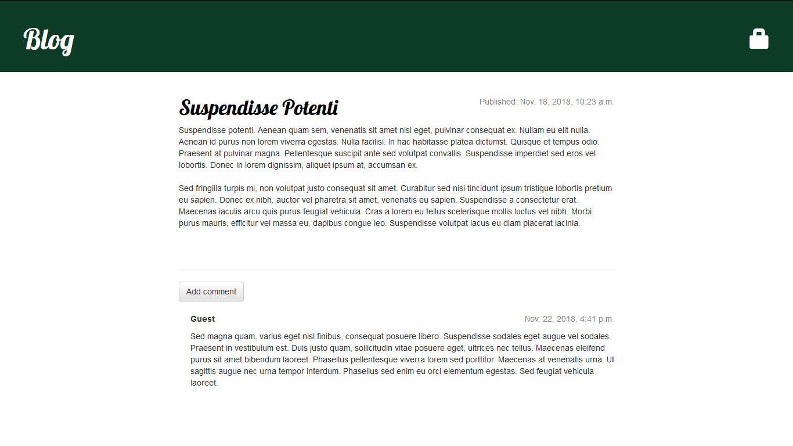

## Prerequisites

To start using this project activate virtual environment first or install Django 1.11.~ manually:
```javascript
source ./env/bin/activate
```
or
```javascript
pip install -r requirements.txt
```

## How-to

After successful installation of Django start server with command:
```javascript
python3 manage.py runserver
```

Go to the address in web browser:
```javascript
127.0.0.1:8000
```

Start page of the blog looks as follows:


Click on any post title to look at single post:



Login as `admin` using password `q1w2e3r4`:
```javascript
127.0.0.1:8000/admin
```


Admin panel looks like the follows:


Switch to main page with admin privileges:


Click plus sign to create new post:


Single post page now contains pencil sign to edit post:


Click on it to open post editor:


