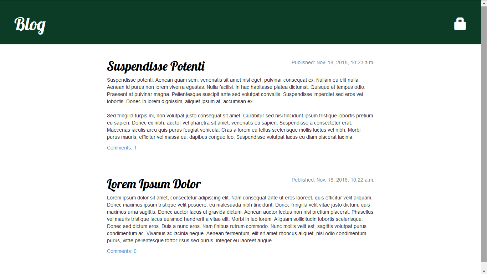
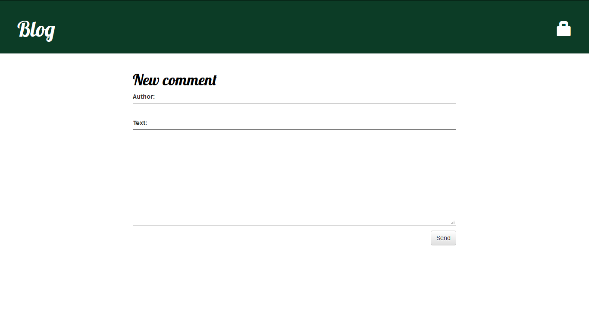
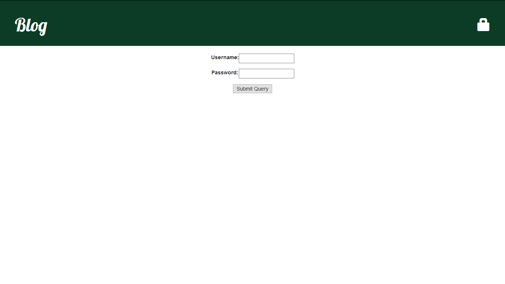
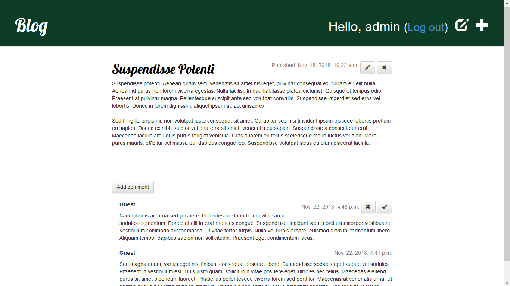
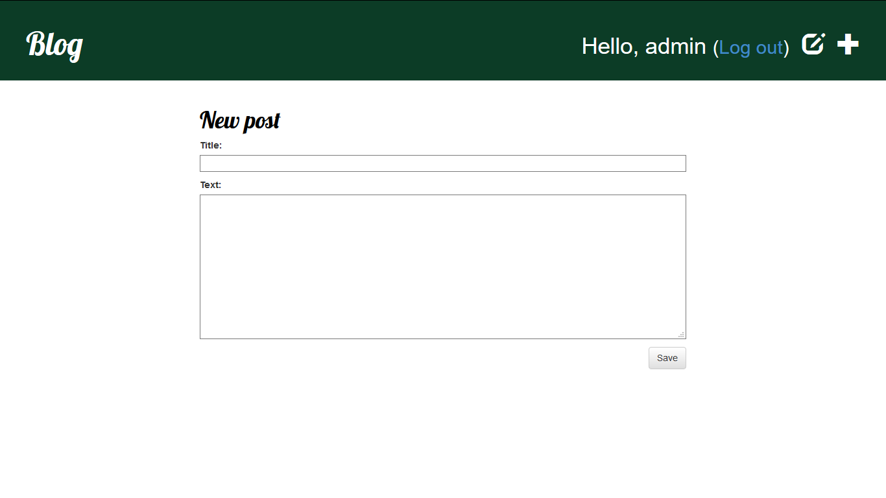

## Prerequisites

To start using this project activate virtual environment first or install Django 1.11.~ manually:
```javascript
source ./env/bin/activate
```
or
```javascript
pip install -r requirements.txt
```

## How-to

After successful installation of Django start server with command:
```javascript
python3 manage.py runserver
```

Go to the address in web browser:
```javascript
127.0.0.1:8000
```

Start page of the blog looks as follows:



Click on any post title to look at single post:


Click on 'Add comment' to send comment for moderation:



Click on the 'Lock' sign to login as `admin` using password `q1w2e3r4`:



Admin options looks like the follows:


Switch to any post with admin edit, delete and approve privileges:



Click on the 'Pencil' sign to open post editor:


Click on the 'Draft' sign to list unpublished posts:


Switch to any of draft posts to publish, edit or delete it:


And of course click on the 'Plus' sign to create new post:


